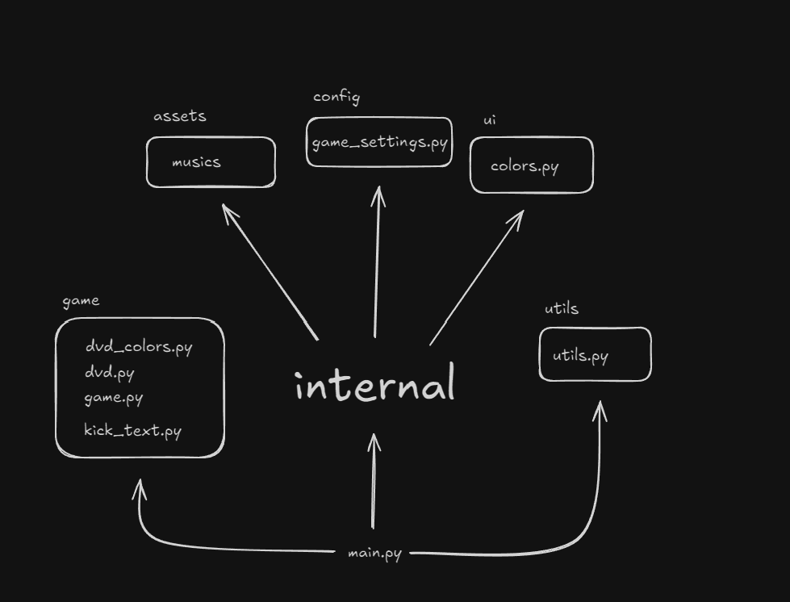

<div align="center">

</div>

## Projeto: Simulação de DVD

Este projeto simula o clássico efeito de um logo de DVD quicando na tela. Ele é construído usando a biblioteca Pygame para Python.

### Funcionalidades

* **Movimento de Quique Realista:** O texto "DVD" se move pela tela e quica nas bordas de forma semelhante ao efeito original.
* **Mudança de Cor:** A cor do texto muda a cada quique.
* **Música de Fundo:** O projeto inclui música de fundo, com opções para pausar/reproduzir e trocar a música.
* **Configurações:** As configurações do jogo, como tamanho da tela e FPS, podem ser ajustadas.

### Como Executar

1.  Certifique-se de ter o Python e o Pygame instalados.
2.  Clone o repositório.
3.  Navegue até o diretório do projeto.
4.  Execute o arquivo `main.py`:

    ```bash
    python main.py
    ```

### Controles

* **ESC:** Sair do jogo.
* **S:** Trocar a música de fundo.
* **Espaço:** Pausar/reproduzir a música.

### Estrutura do Projeto

* `main.py`: Ponto de entrada do jogo.
* `game/`:
    * `game.py`: Lógica principal do jogo.
    * `dvd.py`: Classe base para o objeto DVD.
    * `dvd_colors.py`:  Classe que herda de DVD e adiciona a funcionalidade de mudança de cor.
    * `kick_text.py`: Classe que herda de DvdColors e implementa a lógica de movimento e quique.
* `internal/`:
    * `config/`:
        * `game_settings.py`: Configurações do jogo (tamanho da tela, FPS, etc.).
    * `ui/`:
        * `colors.py`: Definições de cores.
    * `assets/`:
        * `ben_10.mp3`
        * `7k.mp3`
        * `te_esqueci.mp3`
* `utils/`:
    * `utils.py`: Funções utilitárias (geração de cor aleatória).

### Classes Principais

* `Game`:  Gerencia o loop do jogo, eventos, e a inicialização do Pygame.
* `DVD`: Classe base para o objeto que se move na tela.
* `DvdColors`:  Extende a classe DVD para adicionar funcionalidade de mudar de cor.
* `KickText`: Extende a classe DvdColors para implementar o movimento de "quique" do texto.

### Diagrama de Classes

\[Espaço para Diagrama UML]

### Melhorias Futuras

* Adicionar mais opções de personalização (tamanho do texto, velocidade, etc.).
* Implementar diferentes formas ou imagens, não apenas texto.
* Melhorar o tratamento de eventos e a responsividade do jogo.